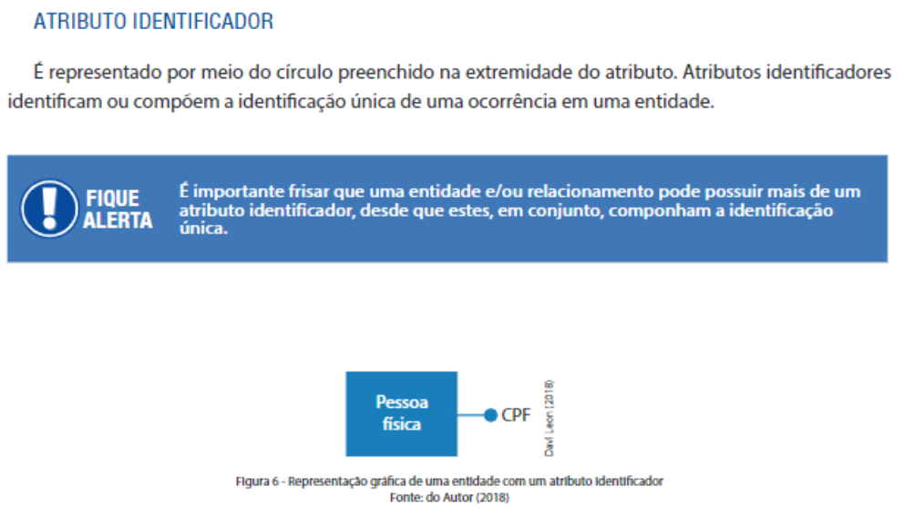

# Relatório de Estudos

**Nome do Estagiário:** [Gabriel Eliezer Rodrigues]  
**Data:** [12/08/2024]  
**Tema:** Modelagem de Dados

## Assuntos Vistos

- [Modelagem de Dados]
- [Diagrama ER, Modelo Lógico e Físico]
- [Ferramentas para Modelagem]
- [Consultas em BD]
  
## O Que Entendi
A Modelagem de Dados é essencial em projetos que requerem a criação de um banco de dados. Quando precisamos estruturar um banco de dados, a primeira etapa é elaborar o diagrama entidade-relacionamento (ER), seguido pelos modelos lógico e físico. Esses passos são cruciais, especialmente em projetos complexos, pois fornecem uma base sólida para o desenvolvimento. Sem um diagrama para orientar, torna-se difícil gerenciar as várias etapas do projeto, e a consulta ao que já foi feito pode se tornar confusa. Além disso, em casos onde se entra em um projeto novo, a ausência de um diagrama torna o entendimento do sistema demorado e complicado.
## O que é?
Quando trabalhamos com bancos de dados e criamos diagramas de entidade relacionamento, isso é modelagem de dados, porém, não se prende a sómente isso. Modelagem de dados abrange as estruturas de um banco de dados, desde seu inicio à conclusão da sua criação. Em uma modelagem de banco de dados temos que, identificar entidades e suas propriedades, identificar as relações entre as entidades, identificar técnicas de modelagem de dados e, otimizar e iterar seu banco de dados.   
A Modelagem de Dados é importante para definir as Regras de Negócios e a arquitetura de um Banco de Dados, ou seja descrever estruturas lógicas e físicas do banco.

## Links Utilizados (se houver) 

- [AWS - Modelagem de Dados](https://aws.amazon.com/pt/what-is/data-modeling/)
- [Estrante de Livros - SENAI](https://estantedelivros.senai.br/view/1HkX7Xc-rPBh8CrRT_DaYO8RtgEhxdU01)
- [Youtube - Boson Treinamentos](https://www.youtube.com/watch?v=Q_KTYFgvu1s&list=PLucm8g_ezqNoNHU8tjVeHmRGBFnjDIlxD)
- [Fundação Bradesco - Modelagem de Dados](https://www.ev.org.br/cursos/modelagem-de-dados)

## Trilha de Aprendizagem

**Módulos/Etapas Feitas:**  
1. **[Módulo/Etapa 1]:** Modelo conceitual, Modelo Lógico e Modelo Fisico.
2. **[Módulo/Etapa 2]:** Abstração de Dados, <!-- Abstração de dados é o processo que transferimos um problema do Mundo real para o mundo da modelagem de dados que nesse primeiro momento é o Modelo Conceitual-->tipos de atributos,<!--Aqui temos os atributos identificados, atributos não identificados, atributos multivalorados e atributos compostos--> minimundo e Abstração.
<!--

Atributos identificados são primary key, candidate key, surrogate key

Atributos Não Identificados são os Atributos comuns das tabelas, os que mais aparecem.

-->
3. **[Módulo/Etapa 3]:** Categorigas de um Banco de Dados.

<!-- Nas categorias temos 4, Centralizada, descentralizada, distribuida e replicada

Centralizada: Arquitetura onde os clientes podem acessar o banco de dados. Porém é custosa, a máquina precisa ter um poder de processamento alto.

Descentralizada: Existe mais de um servidor para o Banco de Dados,os dados podem ser trabalhados pelos servidores,

-->

**Desafios Encontrados:**  
Durante o estudo, surge uma dificuldade e é muito conceito pra lebrar de tudo. Essa acredito que seja a dificuldade que fica.

**Próximos Passos:**  
Acredito que relacionado a modelagem de dados o interessante é trabalhar com mais bancos de dados, juntar código com o banco de dados.